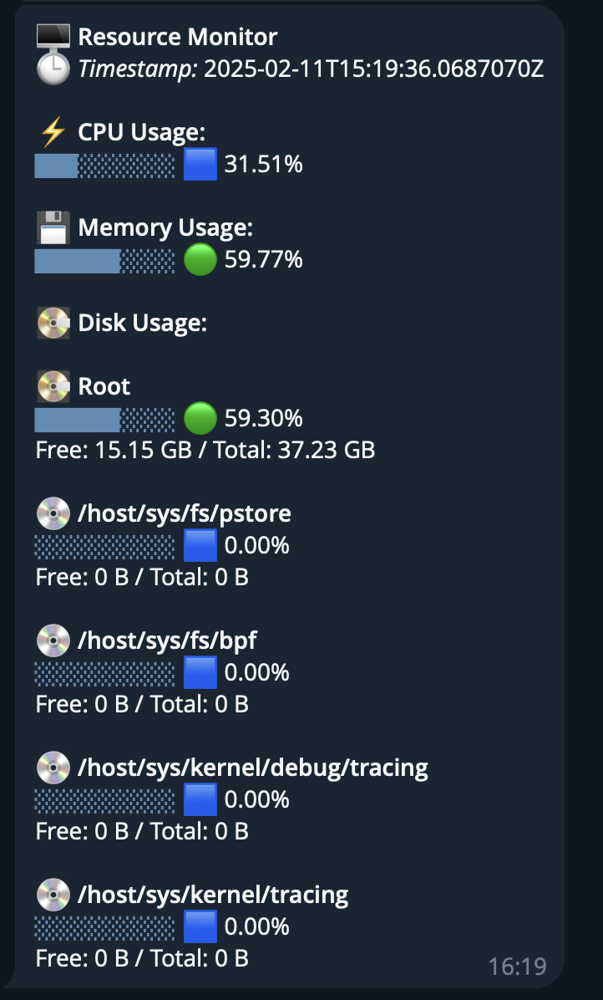

# 📊 Resource Monitor CLI

A simple and powerful system resource monitoring tool that tracks CPU, Memory, and Disk usage in real-time.

## ✨ Features

- 🖥️ Real-time CPU usage monitoring
- 💾 Memory usage tracking
- 💿 Disk space monitoring
- 🔄 Auto-refresh display
- 📱 Optional Telegram bot integration
- 🐳 Docker support
- 🎯 Cross-platform (Windows, Linux, macOS)

## 🚀 Quick Start

### Using Docker (Recommended)

1. Clone this repository:
```bash
git clone https://github.com/yourusername/ResourceMonitorCli.git
cd ResourceMonitorCli
```

2. Copy the example environment file:
```bash
cp .env.example .env
```

3. Run with Docker Compose:
```bash
docker-compose up -d
```

### 🔧 Configuration

The application can run in two modes:

#### 1. Console Mode 🖥️
- Shows metrics directly in your terminal
- Updates every second by default
- No additional configuration needed

Example output:
```
=== Resource Monitor ===
Timestamp: 2025-02-11T13:43:29.3309060Z
CPU Usage: 22.00%
Memory Usage: 99.00%
Disk Usage:
  / - Used: 94.58%  Free: 12 GB / Total: 228 GB
  /System/Volumes/VM - Used: 94.58%  Free: 12 GB / Total: 228 GB
  /System/Volumes/Preboot - Used: 94.58%  Free: 12 GB / Total: 228 GB
  /System/Volumes/Update - Used: 94.58%  Free: 12 GB / Total: 228 GB
  /System/Volumes/Data - Used: 94.58%  Free: 12 GB / Total: 228 GB
  ... and more mounted volumes ...
```

#### 2. Telegram Mode 📱
- Sends metrics to your Telegram chat
- Requires Telegram bot token and chat ID
- Set custom update intervals

Example output:


## ⚙️ Environment Variables

| Variable | Description | Default | Required |
|----------|-------------|---------|----------|
| TZ | Timezone | UTC | No |
| TELEGRAM_TOKEN | Telegram bot token | empty | No |
| CHAT_ID | Telegram chat ID | empty | Yes (if using Telegram) |
| INTERVAL_MINUTES | Telegram update interval in minutes | 60 | No |

### Command Line Arguments 🔧
The application accepts the following command-line arguments, which are automatically set from environment variables in Docker:

| Argument | Short | Description | Example |
|----------|-------|-------------|---------|
| --telegram | -t | Telegram bot token | -t your_bot_token |
| --chat | -c | Telegram chat ID | -c your_chat_id |
| --interval | -i | Update interval in minutes | -i 60 |

### Mode Selection 🔄
- Without `-t` argument: Console Mode (updates every second)
- With `-t` argument: Telegram Mode (requires `-c` for chat ID)

### Example Configurations

1. **Console Mode** (default):
```env
TZ=UTC
# No other variables needed
```

2. **Telegram Mode**:
```env
TZ=UTC
TELEGRAM_TOKEN=your_bot_token
CHAT_ID=your_chat_id
INTERVAL_MINUTES=60  # optional
```

## 📱 Setting Up Telegram Mode

1. Create a Telegram bot using [@BotFather](https://t.me/botfather)
2. Get your chat ID using [@userinfobot](https://t.me/userinfobot)
3. Update your `.env` file:
```env
TELEGRAM_TOKEN=your_bot_token
CHAT_ID=your_chat_id
INTERVAL_MINUTES=60
```

## 🐳 Docker Deployment

### System Requirements
- Docker
- Docker Compose
- 128MB RAM minimum
- Root/sudo access (for system metrics)

### Resource Limits
- Memory: 256MB limit
- Memory reservation: 128MB

## 🔍 Monitoring Details

The tool monitors:
- 📈 CPU Usage %
- 📊 Memory Usage %
- 💾 Disk Usage for all mounted drives
  - Used space
  - Free space
  - Total capacity

## 🛟 Troubleshooting

### Common Issues

1. **No CPU metrics (0%)**
   - Check if running with proper permissions
   - Verify system monitoring access

2. **Container won't start**
   - Ensure Docker has privileged access
   - Check system resources
   - Verify environment variables

3. **Telegram bot not responding**
   - Verify bot token and chat ID
   - Ensure internet connectivity
   - Check bot permissions

## 🔒 Security Notes

- The container runs in privileged mode to access system metrics
- Mounted volumes are read-only
- Environment variables are used for sensitive data
- No root access inside container

## 📝 License

MIT License - feel free to use and modify!

## 🤝 Contributing

Contributions are welcome! Please feel free to submit a Pull Request.
